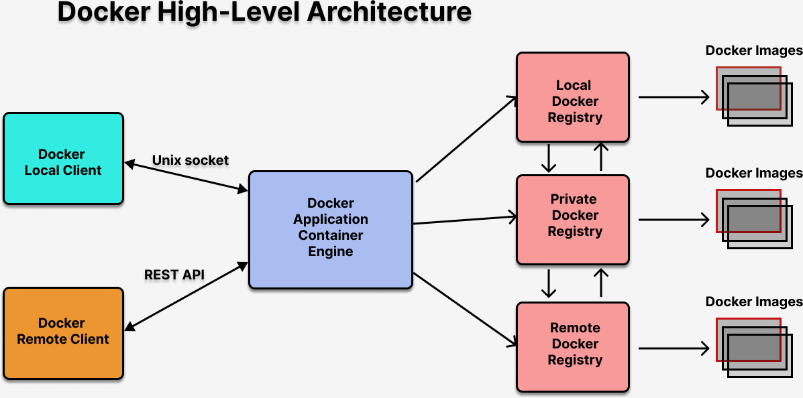

# Day1

## What is Cloud Computing?
- Pay as you to Go pricing
- Flexible infrastucture that can used on demand
- Highly Available (HA)
- Dynamic scaling
- Cheaper than procuring and maintaining own Servers

## Why do we need Cloud Computing?
- End-users can scale services to fit their needs, customize applications and access cloud services from anywhere with an internet connection
- Enterprise users can get applications to market quickly, without worrying about underlying infrastructure costs or maintenance
- Cloud services give enterprises a competitive advantage by providing the most innovative technology available
- Scalability
  - Cloud infrastructure scales on demand to support fluctuating workloads
- Storage options
  - Users can choose public, private, or hybrid storage offerings, depending on security needs and other considerations
- Control choices 
  - Organizations can determine their level of control with as-a-service options.  
      - Software as a service (SaaS)
      - Platform as a service (PaaS) and 
      - Infrastructure as a service (IaaS)
- Tool selection
  - Users can select from a menu of prebuilt tools and features to build a solution that fits their specific needs
- Security features
  - Virtual private cloud, encryption, and API keys help keep data secure
- Efficiency
  - Accessibility
    - Cloud-based applications and data are accessible from virtually any internet-connected device
  - Speed to market
    - Developing in the cloud enables users to get their applications to market quickly
  - Data security
    - Hardware failures do not result in data loss because of networked backups
  - Savings on equipment
    - Cloud computing uses remote resources, saving organizations the cost of servers and other equipment
  - Pay structure
    - A “utility” pay structure means users only pay for the resources they use
- Strategic value
  - Streamlined work
    - Cloud service providers (CSPs) manage underlying infrastructure, enabling organizations to focus on application development and other priorities
  - Regular updates
    - Service providers regularly update offerings to give users the most up-to-date technology
  - Collaboration
    - Worldwide access means teams can collaborate from widespread locations
  - Competitive edge
    - Organizations can move more nimbly than competitors who must devote IT resources to managing infrastructure
    
## What is an Azure Region?
- you can think as a City like Mumbai, Chennai, Hyderabad, Bengaluru

## What is an Azure Availability Zone?
- Within each Azure Region(City), there might be several Availability Zones
- Each Availability Zone represents one Data Center
- Eg: mumbai-west1a
      mumbai-west1b
      mumbai-west1c

## What is Data Centre
- a collection of many servers located in one Availability Zone under a Region
- Sever 1000s or even lakhs of Servers might be there in a single Availability Zone

## What is on-prem servers?
- On premise servers ( aka on-prem )
- Your company owned servers

## Different types of RAM
- UDIMM (Unbuffered Dual Inline Memory Module) - Used in Desktops
- SODIMM (Small Outline Dual Inline Memory Module) - Used in Laptops
- RDIMM (Registered Dual Inline Memory Module) - Used in Servers/Wokstations

## CPU Socket
- This allows installing and replacing the Central Processing Unit without soldering
- CPU Socket is where the Processor Integrated Chip is installed on the Motherboard
- A CPU socket uses a series of pins to connect a CPU's processor

Desktop and Laptops
  - usually have just one CPU Socket on a Motherboard
Workstations and Servers
  - may have one to many CPU Sockets on a Motherboard

## Integrated Chip (Processor)
- SCM ( Single Chip Module ) - One IC will has One Processor ( 1 Processor per Socket )
- MCM ( Multiple Chip Module ) - One IC will have many Processors ( 1 IC may have 2 ~ 8 Processors or more )

## Multiple Cores
1 Processor - may have many CPU Cores
1 Processor - may have 256 cores

MCM with 8 Processor ( Each Processor having 256 cores )
Per Socket = 8 x 256 Core = 2048 Cores

Server Motherboardss that has 8 Sockets
MCM ( 1 IC with 8 Processors )
Each Processor having 256 Cores 

8 x 256 * 8 = 16384 Cores

## What is Intel Hyperthreading/AMD SMT(Simultaneous Multi Threading) ?
- Each CPU Core has two or more Pipeline that can execute threads in parallel
- A CPU Core that supports Hyperthread/SMT can support 2 to 8 virtual cores
- In other words certain high-end CPU Cores support 8 virtual cores per physical core
- Most CPU Cores support 2 or 4 virtual cores per Physical CPU Core
- Assuming each Physical Core supports 4 Pipelines(vCores)
- If a Processor has 8 Physical Core, the total virtual cores is equivalent to 8 x 4 = 32 Virtual Cores
- Virtualization Softwares(Hypervisors) allocate virtual cores to Virtual Machines, hence if a laptop with 4 Physical Cores with Hyperthread is equivalent to 4 x 2 = 8 Virtual Cores, so technically 1 Host OS + 7 Guest OS(Virtual Machines) can run in parallel.

## What are the deciding factors that control the number of Virtual Machines that can be supported by a Single Server/Desktop/Laptop?
- RAM (Memory )
- HDD/SDD (Storage)
- Number of Cores

General Purpose Processors
1. AMD ( Invented 64 Bit Processors x86_64 Instructions )
 - 32 bit (AMD pays royalty for Intel's x86 Instructions set)
2. Intel (Invented 32 Bit Processors x86 Instructions )
 - 64 bit (Intel pays royalty for AMD's x64 Instruction set)

Virtualization Feature
AMD's virtualization feature
  - AMD-V (CPU Feature set)
Intel's Virtualization feature
  - VT-X (CPU Feature set)

## Subnet (IP Block - Address Range)
172.17.0.0/16 (IPV4 IP Address - 32 bit wide(4 bytes))
A.B.C.D/16(Bit are Fixed from Left - 172 and 17 are fixed)
16 - CIDR

172 - 1 byte (8 bit)
17 - 1 byte (8 bit)
0 - 1 byte (8 bit)
0 - 1 byte (8 bit)

172.17.0.0
172.17.0.1
172.17.0.2
...
172.17.0.255
172.17.1.0
172.17.1.1
...
172.17.1.255
...
172.17.255.255

= 255 x 255 = 65536 IP Addresses are there in 172.17.0.0/16

172.17.0.0/24 ( 255 IP Adresses )
172.17.0.0
172.17.0.1
...
172.17.0.255

IPV4(exiting IP format) and IPV6(New type of IP)

IP Address can be Dynamic or Static IP
- Public and Private IP

Virtual Network or Network
- Virtual networks are logically isolated from each other in Azure
- You can configure their IP address ranges, subnets, route tables, gateways, and security settings, much like a traditional network in your data center
- Virtual machines in the same virtual network can access each other by default
- Each Network can be divided into many Subnets

Subnet 
- Virtual Network can be divided into one or more Subnet ( small logical networks )
- A subnet is a range of IP addresses in your virtual network, which can be used to isolate virtual machines from each other or from the Internet.

## What is Private Cloud?
- Your on-prem data center

## What is Public Cloud?
- Azure
- AWS
- GCP

## Hybrdid Cloud
- Combination of your Private Cloud and Public Cloud

## OpenStack 
- you can manage virtual machine of different configurations on demand just like we can create VMs in Azure, AWS, GCP, etc.,
- Virtual Machines using the On-Prem Servers

## VMWare vSphare/vCenter (Bare Metal Hypervisor)

## What is Configuration Management Tools?
- Examples
  - Ansible, Puppet, Chef
- Infrastructure as a Code Tool
- Configuration Management Tools helps in automating software installation on a existing VMs, Physical Machine with OS
- For example, we can install a Webserver on a existing OS
- You can users on a existing OS

## What is a Provisioner tool?
- automation tools that can help in automating infrastructure
- can automate creating Virtual Machines(OS), Container, installing OS on a Physical Machine
- Example
   - HashiCorp Vagrant, Docker 
  
## What is an Orchestration Platform?
- container management platform
- manages containerized application/microservices
- Example
  - Google Kubernetes
  - RedHat OpenShift
  - Docker SWARM

## What is Cloudformation?
- an Infrastructure as a Code (IaC) that helps in infrastructure automation in AWS
- it is a native technology developed by AWS to manage and automate infrastructure within AWS
- it doesn't support automating Infrastrucure in other cloud environments

## What is Terraform?
- Infrastructure as a Code(IaC) Tool
- primarily it helps in automating infrastructure (VMs, Storage, Load Balancers, etc )
- it is a cloud newtral Infrastrucure as a Code(IaC) tool that supports AWS, Azure, GCP, Local resources etc.,

You need a Virtual Machine with an CentOS 8 installed (Provisioner)
 - you could use Vagrant to provision Virtual Machine and automate CentOS 8 installation with SSH access based key pairs
 - Vagrant tools reads all the automation code from a script file called Vagrantfile ( ruby )
 - Developed by HashiCorp 

You wish to install Docker on that CentOS 8 Virtual Machine ( Configuration Management Tool)
- You could write ansible playbook to install Docker Container Engine

You wish to deploy a containerized Microservice ( Provisioner - IaC)
- You could use Docker

You wish to manage the microsevice (Orchestration Platform)
- Kubernetes/OpenShift to manage the containerized microservices

## What is Domanin Specific Language(DSL)?
- the language in which the automation code is written

Kubernetes/OpenShift
- it can be installed on your local Laptop/Desktop/Workstation/Server
- it can be installed in AWS/Azure/GCP on Virtual Machines on the public cloud
- Managed Services (SaaS - Model)
- In Azure
  - Azure Kubernetes Service (AKS) - Managed Kubernetes Cluster (Orchestration Platform)
  - Installation of Kubernetes is taken care by Azure
- In AWS
  - Elatic Kubernetes Service (EKS) - Managed Kubernetes Cluster (Orchestration Platform)
- it provides an environment to run Microservices or Container applications
- it provides an environment for containerized application or microservice and make them High Available
- it is self-healing platform ( it know how to heal itself as well as microservice that are managed by them)
- it has inbuilt 

Infrastructure as a Service (IaaS)
- Only the hardware is rented from Public Cloud (AWS,Azure,GCP,IBM Cloud, VMWare Cloud,Oracle Cloud,etc)
- OS System Licenses are managed by us

Platform as a Service (PaaS)
- We rent Hardware and Operating System from PUblic Cloud Vendors (AWS, Azure, GCP, etc.,)
- We need install software like Oracle DB Server, Oracle Weblogic ourself either manually or in automated fashion

Software as a Service(SaaS)
- AWS EKS or Auzre AKS are examples

Infrastructure as a Code Tool
- helps in automation OS installation, softwares via source code
Examples:
1. Docker
2. Vagrant
3. Kubernetes/OpenShift/Docker SWARM
4. Ansible/Puppet/Chef/Salt(SaltStack)

# Docker

## High-Level Architecture


## Installing Docker in Ubuntu
```
sudo apt-get update
sudo apt-get install ca-certificates curl gnupg lsb-release
sudo mkdir -p /etc/apt/keyrings
curl -fsSL https://download.docker.com/linux/ubuntu/gpg | sudo gpg --dearmor -o /etc/apt/keyrings/docker.gpg

echo \
  "deb [arch=$(dpkg --print-architecture) signed-by=/etc/apt/keyrings/docker.gpg] https://download.docker.com/linux/ubuntu \
  $(lsb_release -cs) stable" | sudo tee /etc/apt/sources.list.d/docker.list > /dev/null
  
sudo apt-get update
sudo apt-get install docker-ce docker-ce-cli containerd.io docker-compose-plugin
sudo systemctl enable docker
sudo systemctl start docker
sudo systemctl status docker
sudo usermod -aG docker $USER
newgrp docker
docker --version
docker images
```

## Docker Commands

## Create a mysql db server container
```
docker run -d --name mysql --hostname mysql bitnami/mysql:latest
```

Expected output
<pre>
<b>jegan@tektutor.org</b>:~/terraform-oct-2022$ <b>docker run -d --name mysql --hostname mysql -e MYSQL_ROOT_PASSWORD=root bitnami/mysql:latest</b>
Unable to find image 'bitnami/mysql:latest' locally
latest: Pulling from bitnami/mysql
1d8866550bdd: Pull complete 
1b8c0f27c1e5: Pull complete 
Digest: sha256:fcb08fe71a17b393852db74371be05de6bb0484aa59b0f24aa6a073174d30f48
Status: Downloaded newer image for bitnami/mysql:latest
7bb941f77d465c1c34f07f22c46e63f6f12dd87dcecb45a52e5fd813739e293f
</pre>

Listing the running containers
<pre>
<b>jegan@tektutor.org</b>:~/terraform-oct-2022$ <b>docker ps</b>
CONTAINER ID   IMAGE                  COMMAND                  CREATED          STATUS          PORTS      NAMES
7bb941f77d46   bitnami/mysql:latest   "/opt/bitnami/script…"   38 seconds ago   Up 35 seconds   3306/tcp   mysql
</pre>

## Getting inside the mysql db server container
Type 'root' as the password without quotes when prompted.
```
docker exec -it mysql sh
mysql -u root -p
SHOW DATABASES
CREATE DATABASE tektutor;
USE tektutor;
CREATE TABLE training ( id INT NOT NULL, name VARCHAR(100) NOT NULL, duration VARCHAR(200) NOT NULL, PRIMARY KEY(id) );
INSERT INTO training VALUES (1, "DevOps", "5 Days");
INSERT INTO training VALUES (2, "Terraform", "5 Days");
SELECT * FROM training;
exit
exit
```
## Installing Terraform in Ubuntu
```
wget -O- https://apt.releases.hashicorp.com/gpg | gpg --dearmor | sudo tee /usr/share/keyrings/hashicorp-archive-keyring.gpg

echo "deb [signed-by=/usr/share/keyrings/hashicorp-archive-keyring.gpg] https://apt.releases.hashicorp.com $(lsb_release -cs) main" | sudo tee /etc/apt/sources.list.d/hashicorp.list

sudo apt update && sudo apt install terraform
```

Checking if Terraform is installed properly
```
terraform version
terraform
```

Expected output

<pre>
<b>jegan@tektutor.org</b>:~/terraform-oct-2022$ <b>terraform version</b>
Terraform v1.3.2
on linux_amd64
<b>jegan@tektutor.org</b>:~/terraform-oct-2022$ <b>terraform</b>
Usage: terraform [global options] <subcommand> [args]

The available commands for execution are listed below.
The primary workflow commands are given first, followed by
less common or more advanced commands.

Main commands:
  init          Prepare your working directory for other commands
  validate      Check whether the configuration is valid
  plan          Show changes required by the current configuration
  apply         Create or update infrastructure
  destroy       Destroy previously-created infrastructure

All other commands:
  console       Try Terraform expressions at an interactive command prompt
  fmt           Reformat your configuration in the standard style
  force-unlock  Release a stuck lock on the current workspace
  get           Install or upgrade remote Terraform modules
  graph         Generate a Graphviz graph of the steps in an operation
  import        Associate existing infrastructure with a Terraform resource
  login         Obtain and save credentials for a remote host
  logout        Remove locally-stored credentials for a remote host
  output        Show output values from your root module
  providers     Show the providers required for this configuration
  refresh       Update the state to match remote systems
  show          Show the current state or a saved plan
  state         Advanced state management
  taint         Mark a resource instance as not fully functional
  test          Experimental support for module integration testing
  untaint       Remove the 'tainted' state from a resource instance
  version       Show the current Terraform version
  workspace     Workspace management

Global options (use these before the subcommand, if any):
  -chdir=DIR    Switch to a different working directory before executing the
                given subcommand.
  -help         Show this help output, or the help for a specified subcommand.
  -version      An alias for the "version" subcommand.
</pre>

## Install Microsoft Visual Studio code editor
```
sudo snap install code --classic
```

## Creating a docker container using Terraform script

Create a folder named lab1 under your home directory
```
mkdir -p ~/terraform-oct-2022/Day1/lab1
cd ~/terraform-oct-2022/Day1/lab1
```

First create a file name 'main.tf' with the below content
<pre>
terraform {
  required_providers {
    docker = {
        source = "kreuzwerker/docker"
        version = "~> 2.13.0"
    }
  }
}

provider "docker" {}

resource "docker_image" "nginx" {
  name = "nginx:latest"
  keep_locally = false
}

resource "docker_container" "nginx" {
    image = docker_image.nginx.latest
    name = "my-nginx"
    ports {
        internal = 80
        external = 8080
    }
}
</pre>

Install the providers if it is not present on your local folder
```
cd ~/terraform-oct-2022/Day1/lab1
teraform init
```

Expected output
<pre>
jegan@tektutor.org:~/terraform-oct-2022/Day1/lab1$ <b>terraform init</b>

Initializing the backend...

Initializing provider plugins...
- Finding kreuzwerker/docker versions matching "~> 2.13.0"...
- Installing kreuzwerker/docker v2.13.0...
- Installed kreuzwerker/docker v2.13.0 (self-signed, key ID 24E54F214569A8A5)

Partner and community providers are signed by their developers.
If you'd like to know more about provider signing, you can read about it here:
https://www.terraform.io/docs/cli/plugins/signing.html

Terraform has created a lock file .terraform.lock.hcl to record the provider
selections it made above. Include this file in your version control repository
so that Terraform can guarantee to make the same selections by default when
you run "terraform init" in the future.

Terraform has been successfully initialized!

You may now begin working with Terraform. Try running "terraform plan" to see
any changes that are required for your infrastructure. All Terraform commands
should now work.

If you ever set or change modules or backend configuration for Terraform,
rerun this command to reinitialize your working directory. If you forget, other
commands will detect it and remind you to do so if necessary.
</pre>

### Executing the main.tf to download nginx:latest image and create a container
```
terraform apply
```

Expected output
<pre>
<b>jegan@tektutor.org</b>:~/terraform-oct-2022/Day1/lab1$ terraform apply

Terraform used the selected providers to generate the following execution plan. Resource actions are indicated with
the following symbols:
  + create

Terraform will perform the following actions:

  # docker_container.nginx will be created
  + resource "docker_container" "nginx" {
      + attach           = false
      + bridge           = (known after apply)
      + command          = (known after apply)
      + container_logs   = (known after apply)
      + entrypoint       = (known after apply)
      + env              = (known after apply)
      + exit_code        = (known after apply)
      + gateway          = (known after apply)
      + hostname         = (known after apply)
      + id               = (known after apply)
      + image            = (known after apply)
      + init             = (known after apply)
      + ip_address       = (known after apply)
      + ip_prefix_length = (known after apply)
      + ipc_mode         = (known after apply)
      + log_driver       = "json-file"
      + logs             = false
      + must_run         = true
      + name             = "my-nginx"
      + network_data     = (known after apply)
      + read_only        = false
      + remove_volumes   = true
      + restart          = "no"
      + rm               = false
      + security_opts    = (known after apply)
      + shm_size         = (known after apply)
      + start            = true
      + stdin_open       = false
      + tty              = false

      + healthcheck {
          + interval     = (known after apply)
          + retries      = (known after apply)
          + start_period = (known after apply)
          + test         = (known after apply)
          + timeout      = (known after apply)
        }

      + labels {
          + label = (known after apply)
          + value = (known after apply)
        }

      + ports {
          + external = 8080
          + internal = 80
          + ip       = "0.0.0.0"
          + protocol = "tcp"
        }
    }

  # docker_image.nginx will be created
  + resource "docker_image" "nginx" {
      + id           = (known after apply)
      + keep_locally = false
      + latest       = (known after apply)
      + name         = "nginx:latest"
      + output       = (known after apply)
      + repo_digest  = (known after apply)
    }

Plan: 2 to add, 0 to change, 0 to destroy.
╷
│ Warning: Deprecated attribute
│ 
│   on main.tf line 18, in resource "docker_container" "nginx":
│   18:     image = docker_image.nginx.latest
│ 
│ The attribute "latest" is deprecated. Refer to the provider documentation for details.
│ 
│ (and one more similar warning elsewhere)
╵

Do you want to perform these actions?
  Terraform will perform the actions described above.
  Only 'yes' will be accepted to approve.

  Enter a value: yes

docker_image.nginx: Creating...
docker_image.nginx: Still creating... [10s elapsed]
docker_image.nginx: Creation complete after 16s [id=sha256:51086ed63d8cba3a6a3d94ecd103e9638b4cb8533bb896caf2cda04fb79b862fnginx:latest]
docker_container.nginx: Creating...
docker_container.nginx: Creation complete after 1s [id=1a5051dc83851fbfc4ca64d15f76794d50aa1a1637cc8398b77b4aced22f48c2]
╷
│ Warning: Deprecated attribute
│ 
│   on main.tf line 18, in resource "docker_container" "nginx":
│   18:     image = docker_image.nginx.latest
│ 
│ The attribute "latest" is deprecated. Refer to the provider documentation for details.
│ 
│ (and one more similar warning elsewhere)
╵

Apply complete! Resources: 2 added, 0 changed, 0 destroyed.
</pre>

## Show the current state
```
terraform show
```

Expected output
<pre>
<b>jegan@tektutor.org</b>:~/terraform-oct-2022/Day1/lab1$ terraform show
# docker_container.nginx:
resource "docker_container" "nginx" {
    attach            = false
    command           = [
        "nginx",
        "-g",
        "daemon off;",
    ]
    cpu_shares        = 0
    entrypoint        = [
        "/docker-entrypoint.sh",
    ]
    env               = []
    gateway           = "172.17.0.1"
    hostname          = "1a5051dc8385"
    id                = "1a5051dc83851fbfc4ca64d15f76794d50aa1a1637cc8398b77b4aced22f48c2"
    image             = "sha256:51086ed63d8cba3a6a3d94ecd103e9638b4cb8533bb896caf2cda04fb79b862f"
    init              = false
    ip_address        = "172.17.0.3"
    ip_prefix_length  = 16
    ipc_mode          = "private"
    log_driver        = "json-file"
    logs              = false
    max_retry_count   = 0
    memory            = 0
    memory_swap       = 0
    must_run          = true
    name              = "my-nginx"
    network_data      = [
        {
            gateway                   = "172.17.0.1"
            global_ipv6_address       = ""
            global_ipv6_prefix_length = 0
            ip_address                = "172.17.0.3"
            ip_prefix_length          = 16
            ipv6_gateway              = ""
            network_name              = "bridge"
        },
    ]
    network_mode      = "default"
    privileged        = false
    publish_all_ports = false
    read_only         = false
    remove_volumes    = true
    restart           = "no"
    rm                = false
    security_opts     = []
    shm_size          = 64
    start             = true
    stdin_open        = false
    tty               = false

    ports {
        external = 8080
        internal = 80
        ip       = "0.0.0.0"
        protocol = "tcp"
    }
}

# docker_image.nginx:
resource "docker_image" "nginx" {
    id           = "sha256:51086ed63d8cba3a6a3d94ecd103e9638b4cb8533bb896caf2cda04fb79b862fnginx:latest"
    keep_locally = false
    latest       = "sha256:51086ed63d8cba3a6a3d94ecd103e9638b4cb8533bb896caf2cda04fb79b862f"
    name         = "nginx:latest"
    repo_digest  = "nginx@sha256:2f770d2fe27bc85f68fd7fe6a63900ef7076bc703022fe81b980377fe3d27b70"
}
</pre>

Verify if there is nginx:latest docker image and also check if my-nginx container is running
```
docker images
docker ps
```

Expected output
<pre>
<b>jegan@tektutor.org</b>:~/terraform-oct-2022/Day1/lab1$ <b>docker images</b>
REPOSITORY      TAG       IMAGE ID       CREATED       SIZE
bitnami/mysql   latest    2bb35ed2ae49   2 days ago    504MB
<b>nginx           latest    51086ed63d8c   12 days ago   142MB</b>
jegan@tektutor.org:~/terraform-oct-2022/Day1/lab1$ <b>docker ps</b>
CONTAINER ID   IMAGE                  COMMAND                  CREATED             STATUS             PORTS                  NAMES
<b>1a5051dc8385   51086ed63d8c           "/docker-entrypoint.…"   5 minutes ago       Up 5 minutes       0.0.0.0:8080->80/tcp   my-nginx</b>
7bb941f77d46   bitnami/mysql:latest   "/opt/bitnami/script…"   About an hour ago   Up About an hour   3306/tcp               mysql
</pre>
